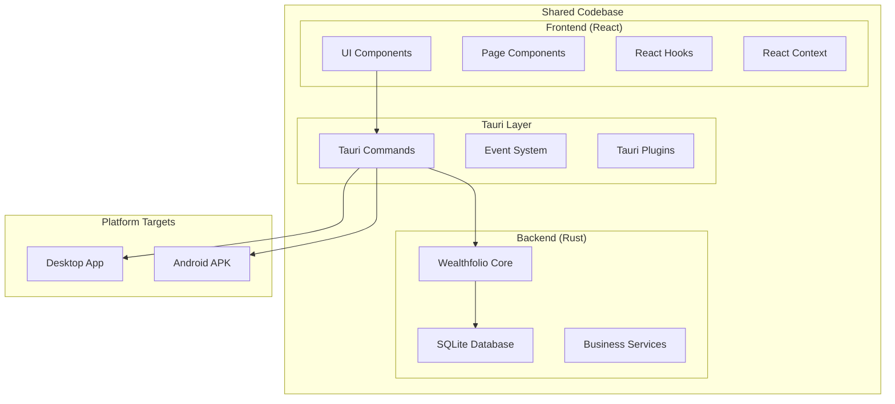
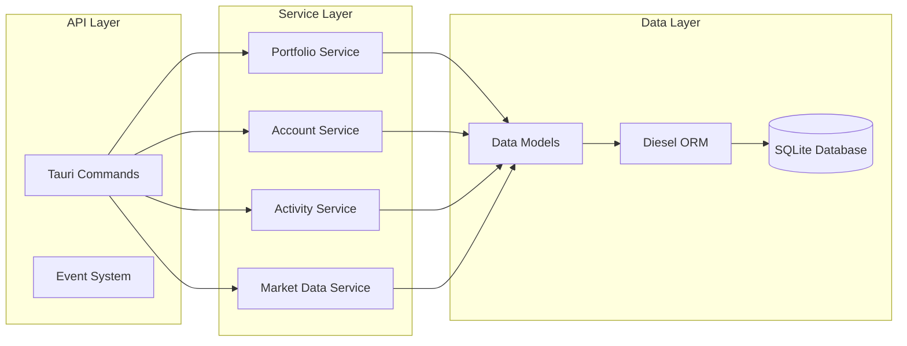

# Design Document

## Overview

This design outlines the conversion of Wealthfolio from a desktop-only Tauri application to a cross-platform application supporting both desktop and Android mobile platforms. The solution leverages Tauri's experimental mobile support to create a native Android application while maintaining maximum code reuse with the existing desktop version.

The design follows a mobile-first responsive approach for the UI while preserving the local-first data architecture that makes Wealthfolio unique. The conversion will result in a single codebase that produces both desktop and mobile artifacts, ensuring consistency and reducing maintenance overhead.

## Architecture

### High-Level Architecture



### Mobile-Specific Architecture Considerations

1. **Responsive UI Layer**: The React frontend will be enhanced with mobile-responsive components
2. **Platform Detection**: Runtime detection of mobile vs desktop for conditional behavior
3. **Touch Optimization**: Enhanced touch targets and mobile-friendly interactions
4. **Navigation Adaptation**: Mobile-appropriate navigation patterns
5. **Performance Optimization**: Mobile-specific performance considerations

### Data Architecture

The existing SQLite-based local storage architecture will be preserved:



## Components and Interfaces

### Mobile UI Components

#### 1. Responsive Layout System

**Mobile Navigation Component**
```typescript
interface MobileNavigationProps {
  currentRoute: string;
  onNavigate: (route: string) => void;
  isCollapsed?: boolean;
}

interface NavigationItem {
  id: string;
  label: string;
  icon: React.ComponentType;
  route: string;
  badge?: number;
}
```

**Mobile Header Component**
```typescript
interface MobileHeaderProps {
  title: string;
  showBack?: boolean;
  onBack?: () => void;
  actions?: HeaderAction[];
}

interface HeaderAction {
  icon: React.ComponentType;
  label: string;
  onClick: () => void;
}
```

#### 2. Touch-Optimized Components

**Mobile Data Table**
```typescript
interface MobileDataTableProps<T> {
  data: T[];
  columns: MobileColumn<T>[];
  onRowSelect?: (row: T) => void;
  loading?: boolean;
  emptyMessage?: string;
}

interface MobileColumn<T> {
  key: keyof T;
  label: string;
  render?: (value: T[keyof T], row: T) => React.ReactNode;
  sortable?: boolean;
  width?: 'auto' | 'full' | number;
}
```

**Mobile Form Components**
```typescript
interface MobileFormFieldProps {
  label: string;
  error?: string;
  required?: boolean;
  children: React.ReactNode;
}

interface MobileInputProps extends InputHTMLAttributes<HTMLInputElement> {
  label: string;
  error?: string;
  icon?: React.ComponentType;
}
```

### Platform Detection Service

```typescript
interface PlatformService {
  isMobile(): boolean;
  isDesktop(): boolean;
  getScreenSize(): ScreenSize;
  getTouchCapability(): TouchCapability;
}

interface ScreenSize {
  width: number;
  height: number;
  orientation: 'portrait' | 'landscape';
}

interface TouchCapability {
  hasTouch: boolean;
  maxTouchPoints: number;
}
```

### Mobile-Specific Tauri Commands

```rust
#[tauri::command]
pub async fn get_device_info() -> Result<DeviceInfo, String> {
    // Return device-specific information
}

#[tauri::command]
pub async fn request_permissions(permissions: Vec<String>) -> Result<PermissionStatus, String> {
    // Handle Android permission requests
}

#[tauri::command]
pub async fn share_data(data: ShareData) -> Result<(), String> {
    // Integrate with Android sharing
}

#[derive(Serialize, Deserialize)]
pub struct DeviceInfo {
    pub platform: String,
    pub version: String,
    pub screen_density: f32,
    pub available_storage: u64,
}
```

## Data Models

### Mobile-Enhanced Configuration

```rust
#[derive(Serialize, Deserialize, Clone)]
pub struct AppConfig {
    pub database_path: String,
    pub is_mobile: bool,
    pub mobile_settings: Option<MobileSettings>,
    pub desktop_settings: Option<DesktopSettings>,
}

#[derive(Serialize, Deserialize, Clone)]
pub struct MobileSettings {
    pub touch_sensitivity: f32,
    pub auto_backup_enabled: bool,
    pub data_sync_wifi_only: bool,
    pub notification_preferences: NotificationPreferences,
}

#[derive(Serialize, Deserialize, Clone)]
pub struct NotificationPreferences {
    pub portfolio_updates: bool,
    pub market_alerts: bool,
    pub backup_reminders: bool,
}
```

### Database Schema Extensions

```sql
-- Mobile-specific settings table
CREATE TABLE mobile_settings (
    id INTEGER PRIMARY KEY,
    user_id TEXT NOT NULL,
    setting_key TEXT NOT NULL,
    setting_value TEXT NOT NULL,
    created_at DATETIME DEFAULT CURRENT_TIMESTAMP,
    updated_at DATETIME DEFAULT CURRENT_TIMESTAMP,
    UNIQUE(user_id, setting_key)
);

-- Device sync tracking
CREATE TABLE device_sync (
    id INTEGER PRIMARY KEY,
    device_id TEXT NOT NULL UNIQUE,
    device_name TEXT NOT NULL,
    last_sync_at DATETIME,
    sync_status TEXT DEFAULT 'pending',
    created_at DATETIME DEFAULT CURRENT_TIMESTAMP
);
```

## Error Handling

### Mobile-Specific Error Types

```rust
#[derive(Debug, thiserror::Error)]
pub enum MobileError {
    #[error("Permission denied: {permission}")]
    PermissionDenied { permission: String },
    
    #[error("Device storage insufficient: {required} bytes needed")]
    InsufficientStorage { required: u64 },
    
    #[error("Network unavailable")]
    NetworkUnavailable,
    
    #[error("App backgrounded during critical operation")]
    AppBackgrounded,
    
    #[error("Touch gesture not recognized")]
    InvalidGesture,
}
```

### Error Recovery Strategies

```typescript
interface ErrorRecoveryStrategy {
  canRecover(error: Error): boolean;
  recover(error: Error): Promise<void>;
  fallback(error: Error): Promise<void>;
}

class MobileErrorRecovery implements ErrorRecoveryStrategy {
  async canRecover(error: Error): Promise<boolean> {
    // Determine if error is recoverable on mobile
  }
  
  async recover(error: Error): Promise<void> {
    // Attempt recovery (e.g., request permissions, retry with different approach)
  }
  
  async fallback(error: Error): Promise<void> {
    // Graceful degradation for mobile
  }
}
```

## Testing Strategy

### Mobile Testing Approach

#### 1. Responsive Design Testing
- **Viewport Testing**: Test across different Android screen sizes (320px to 428px width)
- **Orientation Testing**: Verify layout adaptation for portrait/landscape
- **Touch Target Testing**: Ensure minimum 44px touch targets
- **Gesture Testing**: Validate swipe, pinch, and tap interactions

#### 2. Platform-Specific Testing
```typescript
describe('Mobile Platform Tests', () => {
  beforeEach(() => {
    // Mock mobile environment
    mockPlatform('android');
  });

  test('should adapt navigation for mobile', () => {
    // Test mobile navigation behavior
  });

  test('should handle touch interactions', () => {
    // Test touch-specific interactions
  });

  test('should manage mobile permissions', () => {
    // Test permission handling
  });
});
```

#### 3. Performance Testing
- **Bundle Size**: Ensure mobile bundle remains under 10MB
- **Load Time**: Target under 3 seconds for initial load
- **Memory Usage**: Monitor memory consumption on low-end devices
- **Battery Impact**: Test for excessive battery drain

#### 4. Integration Testing
```rust
#[cfg(test)]
mod mobile_integration_tests {
    use super::*;

    #[tokio::test]
    async fn test_mobile_database_operations() {
        // Test SQLite operations on mobile
    }

    #[tokio::test]
    async fn test_mobile_file_system_access() {
        // Test file operations with mobile permissions
    }

    #[tokio::test]
    async fn test_mobile_background_handling() {
        // Test app backgrounding scenarios
    }
}
```

### Testing Infrastructure

#### Device Testing Matrix
- **Physical Devices**: Test on at least 3 different Android devices
- **Emulators**: Android API levels 24, 28, 31, 34
- **Screen Sizes**: Small (320dp), Normal (360dp), Large (428dp)
- **Performance Tiers**: Low-end, Mid-range, High-end devices

#### Automated Testing Pipeline
```yaml
# Mobile testing pipeline
mobile_tests:
  strategy:
    matrix:
      api_level: [24, 28, 31, 34]
      screen_size: [small, normal, large]
  steps:
    - name: Setup Android Emulator
    - name: Build Mobile App
    - name: Run Integration Tests
    - name: Run UI Tests
    - name: Performance Benchmarks
```

## Implementation Phases

### Phase 1: Foundation Setup
1. **Tauri Mobile Configuration**: Configure Tauri for Android target
2. **Build System**: Set up Android build pipeline
3. **Basic Mobile UI**: Implement responsive layout system
4. **Platform Detection**: Add runtime platform detection

### Phase 2: Core Feature Adaptation
1. **Navigation System**: Implement mobile navigation patterns
2. **Data Tables**: Create mobile-optimized data display components
3. **Forms**: Adapt forms for mobile input
4. **Charts**: Ensure chart components work on mobile

### Phase 3: Mobile-Specific Features
1. **Touch Interactions**: Implement mobile-specific gestures
2. **Permissions**: Handle Android permissions properly
3. **Background Handling**: Manage app lifecycle events
4. **Performance Optimization**: Optimize for mobile performance

### Phase 4: Testing and Polish
1. **Comprehensive Testing**: Execute full testing strategy
2. **Performance Tuning**: Optimize based on testing results
3. **UI Polish**: Refine mobile user experience
4. **Documentation**: Update documentation for mobile development

## Security Considerations

### Mobile Security Enhancements

1. **Data Encryption**: Ensure SQLite database is encrypted on mobile
2. **Secure Storage**: Use Android Keystore for sensitive data
3. **Permission Management**: Request minimal necessary permissions
4. **App Signing**: Implement proper Android app signing
5. **Network Security**: Enforce HTTPS for all network requests

### Privacy Considerations

1. **Local Data**: Maintain local-first approach on mobile
2. **No Cloud Sync**: Preserve privacy by avoiding cloud synchronization
3. **Data Export**: Provide secure data export mechanisms
4. **User Control**: Give users full control over their data

## Performance Optimization

### Mobile Performance Targets

- **App Launch**: Under 3 seconds cold start
- **Navigation**: Under 300ms between screens
- **Data Loading**: Under 1 second for typical queries
- **Memory Usage**: Under 150MB on low-end devices
- **Battery Impact**: Minimal background processing

### Optimization Strategies

1. **Code Splitting**: Implement route-based code splitting
2. **Lazy Loading**: Load components and data on demand
3. **Image Optimization**: Optimize images for mobile screens
4. **Database Optimization**: Use efficient SQLite queries
5. **Bundle Optimization**: Minimize JavaScript bundle size

## Deployment Strategy

### Android Deployment Pipeline

1. **Development Builds**: Local development and testing
2. **Internal Testing**: Team testing with debug builds
3. **Alpha Testing**: Limited external testing
4. **Beta Testing**: Broader user testing
5. **Production Release**: Play Store or direct APK distribution

### Build Configuration

```toml
# Tauri mobile configuration
[tauri.mobile]
android = { min_sdk_version = 24, target_sdk_version = 34 }

[tauri.mobile.android]
package_name = "com.teymz.wealthfolio"
version_name = "1.1.6"
version_code = 116
```

This design provides a comprehensive foundation for converting Wealthfolio to Android while maintaining the core principles of local-first data storage and cross-platform code reuse.