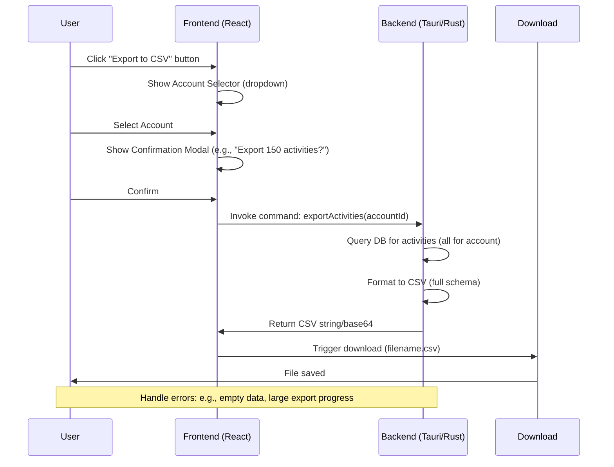

# 产品需求文档：活动导出到 CSV

## 概述

### 产品
Wealthfolio - 一个用于跟踪投资组合、活动、持仓和绩效的桌面应用程序。

### 功能
导出活动到 CSV

### 版本
1.0

### 日期
2025-09-06

### 作者
产品经理 (Sonoma AI)

### 利益相关者
产品团队、工程团队、用户（管理多个账户的投资人）

### 背景
活动页面目前支持通过多步骤向导从 CSV 文件导入活动，包括账户选择、列映射、预览和结果。为了补充这一功能，我们需要实现一个导出功能，允许用户将特定账户的活动导出到 CSV 文件。这可以实现数据备份、在外部工具（例如 Excel）中分析、共享或重新导入到其他系统中。导出将使用完整的活动模式，以确保与导入过程的兼容性，支持部分导入。

### 问题陈述
用户需要为选定的账户导出活动数据，以便在应用程序外部审查历史交易或迁移数据。没有此功能，用户仅限于在应用程序内的查看，这阻碍了数据的可移植性和分析。

## 目标

### 业务目标
- 通过提供完整的データ管理能力（导入/导出对称性）提升用户留存率。
- 支持与电子表格或其他财务工具集成的先进用户。
- 确保数据完整性，用于备份和审计。

### 用户目标
- 轻松将所选账户的所有活动导出为标准 CSV 格式。
- 下载一个可以重新导入到 Wealthfolio 或在其他地方分析的文件。
- 最小化对当前活动页面工作流程的干扰。

### 成功指标
- 发布后活动页面用户参与度提高 20%。
- 用户反馈中报告的数据丢失或格式问题为零。
- 典型数据集（<1000 活动）的导出完成时间 < 5 秒。

## 用户故事 / 需求

### 功能需求

#### 用户故事
1. **作为用户，我希望从活动页面启动导出，以便保存我的数据。**
   - 验收标准：按钮可见，位于“从 CSV 导入”和“手动添加”旁边。

2. **作为用户，我希望选择导出账户，以便针对特定数据。**
   - 验收标准：下拉列表填充活跃账户；如果适用，默认当前过滤的账户。

3. **作为用户，我希望在下载前确认导出细节（例如，活动数量），以避免意外导出。**
   - 验收标准：模态框或内联确认显示账户名称和计数。

4. **作为用户，我希望导出的 CSV 包含所有相关字段，以便匹配导入模式。**
   - 验收标准：列：id, accountId, activityDate (ISO), activityType, assetId, assetSymbol, assetName, quantity, unitPrice, amount, fee, currency, comment, isDraft。

5. **作为用户，我希望文件自动下载，以便立即访问。**
   - 验收标准：类似浏览器的下载提示，文件名如“activities-{accountName}-{date}.csv”。

#### 数据格式
- CSV，使用 UTF-8 编码。
- 标题：确切匹配导入期望以实现兼容性。
- 字段（基于 schemas.ts）：
  - id: UUID（新导入可选）
  - accountId: 字符串
  - activityDate: ISO 8601 日期时间
  - activityType: 枚举（例如，BUY, SELL, DEPOSIT）
  - assetId: 字符串（如果适用）
  - assetSymbol: 字符串
  - assetName: 字符串
  - quantity: 数字（N/A 时为 0）
  - unitPrice: 数字（N/A 时为 0）
  - amount: 数字（用于现金/收入）
  - fee: 数字（N/A 时为 0）
  - currency: 字符串（例如，USD）
  - comment: 字符串（无则为空）
  - isDraft: 布尔值（false）
  - assetDataSource: 枚举（YAHOO/MANUAL）
- 通过将不适用的字段设置为为空/0 来处理特定类型字段。
- 按日期降序排序。

### 非功能需求

- **性能**：支持最多 10,000 活动；如果需要，使用分页，对于大导出显示进度。
- **安全/隐私**：尊重隐私切换；如果启用，在导出中掩码金额（例如，“****”）。无敏感数据如密钥。
- **可用性**：直观 UI，解释字段的工具提示。对于空账户或失败的错误处理（例如，“无可导出数据”）。
- **兼容性**：主要在 macOS 上工作，CSV 可在 Excel/Google Sheets 中打开。
- **可访问性**：按钮 ARIA 标签，可用键盘导航。
- **边缘情况**：
  - 无活动：显示消息“无可导出数据”。
  - 大导出：限制为 50k 行，如果超过则警告。
  - 混合货币：每行包含货币。
  - 草稿活动：包含但如果 isDraft=true 则在评论中标记。

## 功能规范

### UI/UX 流程
导出按钮在标题中触发账户选择（如果未过滤）。确认模态框显示预览计数。后端获取活动，生成 CSV，前端触发下载。

#### Mermaid 图：导出流程

### 技术规范
- **前端**：
  - 在 [`src/pages/activity/activity-page.tsx`](src/pages/activity/activity-page.tsx:58) 标题中添加按钮。
  - 类似于导入：使用 <Button> 和 Icons.Export。
  - 账户选择器：重用导入中的（例如，从 accounts 查询）。
  - 模态框：使用现有的 ui/dialog.tsx。
  - 下载：从 CSV 创建 Blob，使用 URL.createObjectURL。

- **后端**：
  - 新命令在 [`src/commands/activity-export.ts`](src/commands/activity-export.ts)（创建新）：exportActivities(accountId: string) -> string (CSV 内容)。
  - 从 src-core/src/activities/ 查询（使用现有的 searchActivities 但按账户过滤）。
  - 使用 Rust csv crate 或类似格式化 CSV。

- **集成**：
  - 如果导出尊重当前过滤，则更新 activity-table.tsx（可选增强）。
  - 尊重 privacy-context.tsx 以进行掩码。

## 实施任务
1. 创建后端命令以将活动导出到 CSV 字符串。
2. 在 activity-page.tsx 中实现前端导出按钮和流程。
3. 添加确认模态框组件。
4. 使用样本数据测试：各种活动类型、大数据集、隐私开/关。
5. 更新文档：添加到 README 或帮助弹出窗口。
6. QA：验证 CSV 导入兼容性、在 Excel 中的格式。

## 风险和依赖
- 依赖：现有的活动查询/搜索函数。
- 风险：大导出导致 UI 冻结 - 通过异步进度缓解。
- 假设：用户有写入下载文件夹的访问权限。

## 附录
- 参考：导入流程在 [`src/pages/activity/import/activity-import-page.tsx`](src/pages/activity/import/activity-import-page.tsx)，模式在 [`src/pages/activity/components/forms/schemas.ts`](src/pages/activity/components/forms/schemas.ts)。